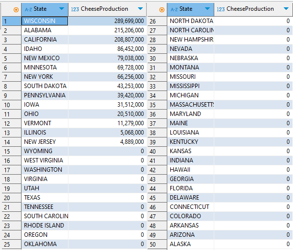

# Final Project: SQL for Data Science
* University of California, Davis
In this project, I will utilize SQL to extract key insights from a relational database containing seven tables. The analysis will be conducted using the SQLITE database system and the DBeaver database management tool.

* Scenario:
As a Data Scientist at the USDA (United States Department of Agriculture), you are tasked with analyzing agricultural production data to assist in future planning and decision-making.

* Context:
You are working with datasets that track the production of various agricultural commodities across different states. These datasets span multiple years and include varying levels of production for each commodity.

* Datasets:
You have access to the following tables:

milk_production,
cheese_production, 
coffee_production, 
egg_production, 
honey_production, 
yogurt_production, 
state_lookup (providing state-related information), 

* Your Objective:
Your manager has tasked you with generating insights from the data to support decisions and guide future agricultural strategies. You will need to use SQL queries to answer questions and uncover trends or anomalies that could influence planning. Some key objectives include:

Assess State-by-State Production: Understand the production levels for each commodity in different states.
Identify Trends and Anomalies: Spot any unusual patterns or trends in production data.
Provide Actionable Insights: Make data-driven recommendations for areas requiring more focus or improvement.


* Entity-Relationship (ER) Diagram of the Dataset.


To begin, we'll remove the commas from the values in each table to maintain data consistency.


```python


## Value format update for the Cheese Production Table

UPDATE cheese_production SET value = REPLACE(Value, ',', '');


## Value format update for the Honey Production Table

UPDATE honey_production SET value = REPLACE(Value, ',', '');


## Value format update for the Milk Production Table

UPDATE milk_production SET value = REPLACE(Value, ',', '');


## Value format update for the Coffee Production Table

UPDATE coffee_production SET value = REPLACE(Value, ',', '');


## Value format update for the Egg Production Table

UPDATE egg_production SET value = REPLACE(Value, ',', '');


## Value format update for the Yogurt Production Table

UPDATE yogurt_production SET value = REPLACE(Value, ',', '');
```

* Ten questions will be answered using six of the seven tables from the ER diagram above, employing a variety of SQL statements.

# Question 1
* Find the total milk production for the year 2023.


```python
SELECT 
    mp.Year,                              ## From the milk production table, pick the year column.
    SUM(mp.Value) AS TotalProduction      ## Determine the sum of the 'Value' column and use 'TotalProduction' as an alias.
FROM 
    milk_production AS mp                 ## The'milk_production' table should be used, aliased as'mp'.
WHERE 
    Year = 2023                           ## Sort the data so that only 2023 records are included.
;
```


* The answer to question one is 91,812,000,000 (ninety-one billion, eight hundred twelve million).

# Question 2
* Which states had cheese production greater than 100 million in April 2023? The Cheese Department wants to focus their marketing efforts there. 


```python
SELECT 
    SUM(cp.Value) AS TotalProduction,       ## Add up the 'Value' column to determine the total amount of cheese produced.
    cp.State_ANSI,                          ## To identify states, choose the State ANSI code column.
    sl.State                                ## From the'state_lookup' table, choose the complete state names.
FROM 
    cheese_production cp                    ## Make the 'cheese_production' table the main source of information.
INNER JOIN 
    state_lookup sl                         ## To combine State information from state_lookup, use an INNER JOIN.
ON 
    sl.State_ANSI = cp.State_ANSI           ## Use the ANSI_state code to match states in both tables.
WHERE 
    cp.Value > 1000000                      ## Filter for cheese production over one million
    AND cp.Year = 2023                      ## Only records from 2023 should be included.
    AND cp.Period = 'APR'                   ## Additional filtering for April-related records
GROUP BY 
    sl.State                                ## To determine totals for each state, group results by state.
;
```

* The results in DBeaver should appear as shown in the following picture:


* 13 states with cheese production exceeding 1 million in April 2023.


# Question 3
 Your manager wants to know how coffee production has changed over the years. 

 What is the total value of coffee production for 2011?


```python
SELECT 
    cp.Value AS TotalProduction,           ## Choose the coffee production value and use 'TotalProduction' as an alias.
    cp.Year                                ## Choose the year to be shown with the production value.
FROM 
    coffee_production cp                   ## Utilize the 'coffee_production' table as the source of information.
WHERE 
    cp.Year = 2011                         ## Sort the information so that only records from 2011 are included.
GROUP BY 
    cp.Year                                ## Group the results by year.
;
```

The results in DBeaver should appear as shown in the following picture:


The total coffee production for 2011 is 7,600,000 (seven million, six hundred thousand).

# Question 4
There's a meeting with the Honey Council next week. Find the average honey production for 2022 so you're prepared.


```python
SELECT 
    AVG(hp.Value) AS AvgHoneyProduction,     ## Calculate the average honey production and alias it as 'AvgHoneyProduction'
    Year                                     ## Select the year to display alongside the average production
FROM 
    honey_production hp                      ## Use the 'honey_production' table as the data source
WHERE 
    Year = 2022                              ## Filter the data to include only records from the year 2022
GROUP BY 
    Year                                     ## Group the results by year (since there is only one year in the filter, this groups all rows together)
;
```

The results in DBeaver should appear as shown in the following picture:


The average amount of honey produced in 2021 is 3,133,275 (Three million one hundred thirty-three thousand two hundred seventy-five.)

# Question 5
* The State Relations team wants a list of all states names with their corresponding ANSI codes. Can you generate that list?


```python
SELECT 
    *                           ## Choose every column in the state_lookup table.
FROM 
    state_lookup AS sl          ## Use'sl' as an alias for the'state_lookup' table.
GROUP BY 
    sl.State                    ## In order to guarantee distinct states in the output, group the results according to the 'State' column.
ORDER BY 
    sl.State_ANSI               ## For a consistent order, sort the results using the 'State_ANSI' column.
;
```


```python
The results on Dbeaver should look like on the following picture:
```


# Question 6,
* For a cross-commodity report, can you list all states with their cheese production values, even if they didn't produce any cheese in April of 2023?


```python
SELECT 
    COALESCE(SUM(cp.Value), 0) AS TotalProduction, ## Sum the 'Value' column and substitute NULL with 0 for states that are not producing.
    sl.State                                       ## Using the'state_lookup' table, to find the states names.
FROM 
    state_lookup sl                                ## use the'state_lookup' table as the main source.
LEFT JOIN 
    cheese_production cp                           ## To include cheese production data, do an LEFT JOIN.
ON 
    cp.State_ANSI = sl.State_ANSI                  ## Use the ANSI state codes to match states.
    AND cp.Year = 2023                             ## Sort cheese production data from 2023 using this filter.
    AND cp.Period = 'APR'                          ## Additional filtering for April's production data
GROUP BY 
    sl.State                                       ## Group the results by state name
ORDER BY 
    TotalProduction DESC                           ## Sort the results in descending order by total production.
;
```

The results on Dbeaver should look like on the following picture:


# Question 7
* Can you find the total yogurt production for states in the year 2022 which also have cheese production data from 2023?
This will help the Dairy Division in their planning.


```python
SELECT 
    SUM(yp.Value) AS TotalYogurtProduction    ## Total production of yogurt is determined by adding the values in the 'Value' column.
FROM 
    yogurt_production yp                      ## Utilize the 'yogurt_production' table as the primary source of information.
WHERE 
    yp.Year = 2022                            ## Restrict results to only contain 2022 records.
    AND yp.State_ANSI IN (                    ## Limit to states that satisfy the subquery's specified criteria.                                      ## Subquery: Identify states with cheese production data in 2023
        SELECT 
            cp.State_ANSI                     ## Utilize the 'cheese_production' table to select State_ANSI codes.
        FROM 
            cheese_production cp              ## Use the 'cheese_production' table to identify states that are pertinent.
        WHERE 
            cp.Year = 2023                    ## Sort the subquery data so that only 2023 records are included.
    );
```

The results on Dbeaver should look like on the following picture:


4,684,380,000 (four billion, six hundred eighty-four million, three hundred eighty thousand) yogurts were produced in all states where cheese was also produced in 2023.

# Question 8
* List all states from state_lookup that are missing from milk_production in 2023.


```python
SELECT 
    sl.State_ANSI,                          ## From the state_lookup table, choose the State ANSI code.
    sl.State                                ## From the state_lookup table, choose the complete state name.
FROM 
    state_lookup sl                         ## Use the state_lookup table as the main source.
WHERE 
    sl.State_ANSI NOT IN (                  ## States that are present in the subquery should be excluded.
        SELECT 
            mp.State_ANSI                   ## Choose the State ANSI codes from the table of milk production.
        FROM 
            milk_production mp              ## Use the milk_production table.
        WHERE 
            mp.Year = 2023                  ## Sort records of milk production from 2023 using this filter.
    );
```

The results on Dbeaver should look like on the following picture:


After running the query, 26 states with no milk production in 2023 are returned.

# Question 9
* List all states with their cheese production values, including states that didn't produce any cheese in April 2023.


```python
SELECT 
    COALESCE(SUM(cp.Value), 0) AS TotalProduction, ## Sum the 'Value' column and substitute NULL with 0 for states that are not producing.
    sl.State                                       ## Using the'state_lookup' table, to find the states names.
FROM 
    state_lookup sl                                ## use the'state_lookup' table as the main source.
LEFT JOIN 
    cheese_production cp                           ## To include cheese production data, do an LEFT JOIN.
ON 
    cp.State_ANSI = sl.State_ANSI                  ## Use the ANSI state codes to match states.
    AND cp.Year = 2023                             ## Sort cheese production data from 2023 using this filter.
    AND cp.Period = 'APR'                          ## Additional filtering for April's production data
GROUP BY 
    sl.State                                       ## Group the results by state name
ORDER BY 
    TotalProduction DESC                           ## Sort the results in descending order by total production.
;
```

The results on Dbeaver should look like on the following picture:



# Question 10
* Find the average coffee production for all years where the honey production exceeded 1 million.


```python
SELECT 
    ROUND(AVG(cp.Value), 0) AS AvgCoffeeProduction  ## Determine the average amount of coffee produced and round it to the nearest decimal place.
FROM 
    coffee_production cp                            ## Make use of the coffee_production table as your main source of information.
INNER JOIN (
                                                    ## Subquery: Determine which years honey production exceeds 1,000,000
    SELECT DISTINCT 
        Year                                        ## Select Year column.
    FROM 
        honey_production                            ## Utilize the table for honey production.                       
    WHERE 
        Value > 1000000                             ## Filter for years when more than a million honeys are produced.
) hp 
ON 
    cp.Year = hp.Year                               ## Align the years that coffee and filtered honey are produced.
;
```


6,426,667 (six million, four hundred twenty-six thousand, six hundred sixty-seven) units of coffee were produced in states with honey production exceeding 1 million.

The results on Dbeaver should look like on the following picture:


* Author Alan Chaves

The primary objective of answering the ten questions posed by the manager has been successfully achieved using the queries provided above. Thank you for taking the time to review my work!


Sadie St. Lawrence and the U.S. Department of Agriculture (USDA) collaborated to provide the datasets for this final assignment, and I am deeply grateful for their support. I want to extend my appreciation to the USDA for offering reliable and comprehensive data. This data has enabled me to deliver a meaningful and practical learning experience, while also creating a valuable portfolio piece that showcases my SQL skills.

* Linkedin: https://www.linkedin.com/in/alan-chaves-a8199a1a1/
* Portifolio: https://www.kaggle.com/alanoliveira434/code


```python

```
